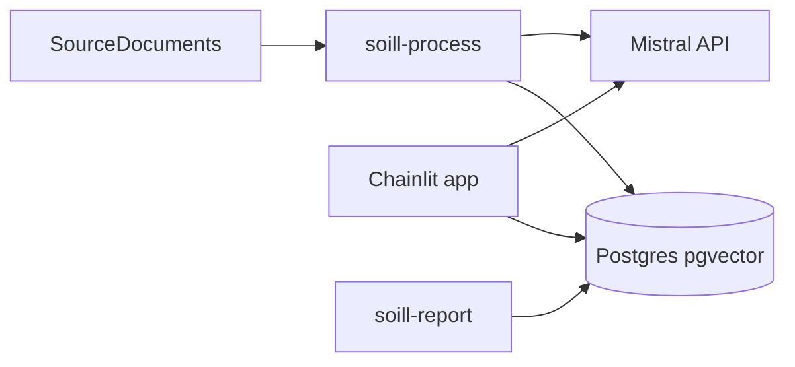

# SOILL Public RAG Chatbot

Monorepo for the SOILL / EU Mission Soil Living Labs public RAG assistant: **Chainlit** UI, **Mistral** embeddings and chat, **PostgreSQL + pgvector** (no MongoDB or FAISS).

*Author:* Professor Stephen Hallett, 5 June, 2026

## Repository layout

| Path | Purpose |
|------|---------|
| [`packages/soill/`](packages/soill/) | Shared library (chunking, embeddings, RAG, Postgres store, logging) |
| [`apps/chatbot/`](apps/chatbot/) | Chainlit web app (deployed on Render) |
| [`apps/admin/`](apps/admin/) | Local CLIs: ingest, schema init, PDF reports |
| [`SourceDocuments/`](SourceDocuments/) | Corpus for local ingestion (`.pdf`, `.docx`, `.txt`) |
| [`sql/001_init.sql`](sql/001_init.sql) | Database schema and indexes |
| [`render.yaml`](render.yaml) | Render blueprint (web service + Postgres) |

## Requirements

- Python **3.11–3.13** (Chainlit 2.11.x is not supported on 3.14)
- [uv](https://docs.astral.sh/uv/) for dependency management
- Render Postgres (or any Postgres with **pgvector**)
- Mistral API key

## History

This repo replaces the earlier 'Giulia' SOILL project chatbot. The technology stack for this chatbot differs from that and is now Mistral, Render.com and Postgres (served by Render) with pgvector.

## Quick start (local testing deployment)

- Ensure the postgres database exists on the server.
    - On running:
    uv run soill-db-init
    If the error is received:
    'Schema initialisation failed: vector type not found in the database'
- Ensure the 'pgvector' extension is installed
    - To do this in psql, type:
    CREATE EXTENSION IF NOT EXISTS vector;
    - to test it worked, run:
    SELECT extname, extversion FROM pg_extension WHERE extname = 'vector';(will return one line)

```bash
# Install dependencies
uv sync --all-packages

# Configure secrets (never commit .env)
cp .env.example .env
# Edit .env: DATABASE_URL, MISTRAL_API_KEY

# Create tables and indexes (once per database)
uv run soill-db-init

# Add documents under SourceDocuments/, then ingest
uv run soill-process

# Run the chat UI (must use apps/chatbot as the app root so public/ assets resolve)
uv run --directory apps/chatbot chainlit run app.py
```

Open the URL shown in the terminal (default `http://localhost:8000`). Welcome images and logos are loaded from `apps/chatbot/public/` via `/public/...` paths in `chainlit.md`.

## Admin commands

| Command | Description |
|---------|-------------|
| `uv run soill-db-init` | Apply `sql/001_init.sql` (idempotent) |
| `uv run soill-process` | Incremental ingest from `SourceDocuments/` |
| `uv run soill-process --dry-run` | Preview ingest changes |
| `uv run soill-process --full-reset --i-know-this-wipes-data` | Wipe chunks/documents and re-ingest all files |
| `uv run soill-report` | PDF export of `soill_conversations` to `Reports/` |
| `uv run soill-report --from-date 2026-01-01 --to-date 2026-06-04` | Date-filtered report (UTC, inclusive) |

Ingestion uses a local `data/manifest.json` (SHA-256 per file). Vectors live only in Postgres.

## Render deployment

1. Create a **Render Postgres** database and enable the **pgvector** extension (run `uv run soill-db-init` once using the **external** `DATABASE_URL` from the dashboard).
2. Deploy with [`render.yaml`](render.yaml) or connect the repo manually:
   - **Web service:** Docker, context = repo root, Dockerfile = `apps/chatbot/Dockerfile`
   - Link `DATABASE_URL` from the Postgres instance
   - Set `MISTRAL_API_KEY` in the dashboard
3. Run `uv run soill-process` **locally** against the external database URL before go-live so the index is not empty.
4. Optional: set `LOG_CLIENT_METADATA=false` on Render unless your privacy notice covers IP/User-Agent storage.

Internal `DATABASE_URL` is for the web service; external URL is for local admin tools.

## Environment variables

See [`.env.example`](.env.example). Key settings:

- `DATABASE_URL` — Postgres connection string
- `MISTRAL_API_KEY`, `MISTRAL_EMBED_MODEL`, `MISTRAL_CHAT_MODEL`
- `RAG_TOP_K`, `RAG_MMR_*` — retrieval and MMR re-ranking
- `CHAT_HISTORY_*` — multi-turn chat and follow-up retrieval expansion
- `LOG_CONVERSATIONS`, `LOG_CLIENT_METADATA`
- `SOURCE_DOCUMENTS` — optional path override for ingest

## Privacy and logging

When `LOG_CONVERSATIONS=true`, each question and answer is stored in `soill_conversations` with `thread_id` and a hashed `visitor_fingerprint`. Raw IP and User-Agent are optional (`LOG_CLIENT_METADATA`). Restrict database access and disclose retention in your privacy notice.

## Architecture



Retrieval: embed the query (with optional history expansion for follow-ups) → pgvector cosine search → optional **MMR** on a larger candidate pool → Mistral chat with numbered citations → “Show cited sources” in the UI.
