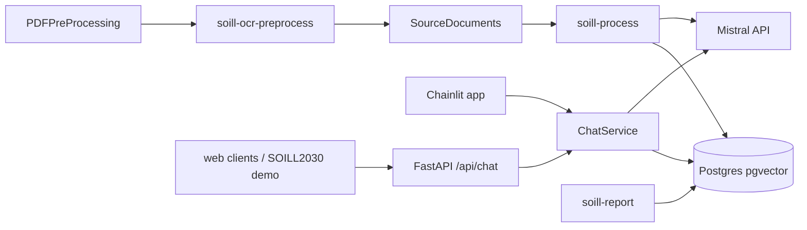

# SOILL project Public RAG Chatbot

Monorepo for the SOILL / EU Mission Soil Living Labs public RAG AI assistant: **Chainlit** UI, **FastAPI** HTTP API, **Mistral** embeddings and chat, **PostgreSQL + pgvector** (no longer using MongoDB or FAISS).

*Authors:* Professor Stephen Hallett, Dr Abdou Khouakhi. 22 June, 2026

## Two frontends (same backend)

Both UIs call the shared `ChatService` in `packages/soill`. They are **siblings**, not parent/child — Chainlit does **not** call the FastAPI HTTP API.

| Frontend | Purpose | How to run |
|----------|---------|------------|
| **Chainlit** (`apps/chatbot/`) | Team testing and RAG prototypes | `uv run --directory apps/chatbot chainlit run app.py` (also on Render) |
| **FastAPI + `web/`** (`apps/api/`) | Production path for website embeds (widget, dedicated page, SOILL2030 demo) | `uv run --directory apps/api uvicorn main:app --port 8080` (also on Render) |

For a public project website (e.g. soill2030.eu), use the **FastAPI** service and the HTML/JS clients under `web/` — not Chainlit.

## Mono-Repository layout

| Path | Purpose |
|------|---------|
| [`packages/soill/`](packages/soill/) | Shared library (chunking, embeddings, RAG, `ChatService`, Postgres store, logging, OCR) |
| [`apps/chatbot/`](apps/chatbot/) | Chainlit web app (Render: team testing / prototypes) |
| [`apps/api/`](apps/api/) | FastAPI HTTP API (`POST /api/chat`) and Docker image for Render |
| [`web/`](web/) | HTML/JS test clients, integration demos, and SOILL2030 site mock |
| [`web/soill2030-demo/`](web/soill2030-demo/) | Polished mock of soill2030.eu with floating chat widget |
| [`documents/`](documents/) | Deployment, architectural approach, OCR workflow, local UI testing |
| [`apps/admin/`](apps/admin/) | Local CLIs: OCR, ingest, schema init, source catalogue, PDF reports |
| [`SourceDocuments/`](SourceDocuments/) | Corpus for local ingestion (`.pdf`, `.docx`, `.txt`) |
| [`PDFPreProcessing/`](PDFPreProcessing/) | OCR batch folders for scanned PDFs (before promotion to `SourceDocuments/`) |
| [`sql/`](sql/) | Database migrations (`001_init.sql`, `002_source_catalog.sql`, …) |
| [`render.yaml`](render.yaml) | Render blueprint — Chainlit + Postgres |
| [`render-demo.yaml`](render-demo.yaml) | Render blueprint — FastAPI API + SOILL2030 static demo |

## Requirements

- Python **3.11–3.13** (Chainlit is not supported on 3.14)
- [uv](https://docs.astral.sh/uv/) for dependency management
- Postgres (with **pgvector**)
- Mistral AI
- **`ocrmypdf`** (system install) — only for scanned or image-heavy PDFs; see [OCR workflow](documents/OCR_PDF_PreProcessingWorkflow.md)

## History

This repo replaces the earlier 'Giulia' SOILL project chatbot. The technology stack for this chatbot differs from that earlier version and is now Mistral, Render.com and Postgres (served by Render) with pgvector.

## Quick start (local testing deployment)

- Ensure the postgres database exists
    - On running:
    uv run soill-db-init
    If the error is received:
    'Schema initialisation failed: vector type not found in the database'
- Ensure the 'pgvector' extension is installed
    - To do this in psql, type:
    CREATE EXTENSION IF NOT EXISTS vector;
    - to test it worked, run:
    SELECT extname, extversion FROM pg_extension WHERE extname = 'vector';(will return one line)

```bash
# Install dependencies
uv sync --all-packages

# Configure secrets (never commit .env)
cp .env.example .env
# Edit .env: DATABASE_URL, MISTRAL_API_KEY

# Create tables and indexes (once per database; applies all sql/*.sql)
uv run soill-db-init

# Add documents under SourceDocuments/, then ingest
# (For scanned PDFs: OCR first — see documents/OCR_PDF_PreProcessingWorkflow.md)
uv run soill-process

# Optional: sync public document titles/URLs from data/source_catalog.json
uv run soill-source-catalog

# Run the Chainlit UI (must use apps/chatbot as the app root so public/ assets resolve)
uv run --directory apps/chatbot chainlit run app.py
```

For local testing, open the URL shown in the terminal (default `http://localhost:8000`). Welcome images and logos are loaded from `apps/chatbot/public/` via `/public/...` paths in `chainlit.md`.

On Render, the team typically runs **two** web services: Chainlit (prototypes) and the FastAPI API (embeddable clients). See [Render deployment](#render-deployment) below.

## Testing the FastAPI API

The HTTP API shares the same `ChatService` as the Chainlit app. Use it for local development and for website embeds (JavaScript widget, dedicated chat page). On Render it is commonly deployed as a separate service (e.g. `soill-chatbot-api`).

Start the API server:

```bash
uv run --directory apps/api uvicorn main:app --reload --port 8080
```

Stop it with **Ctrl+C** in that terminal.

### Interactive API docs (Swagger)

FastAPI provides built-in documentation. With the server running, open:

- **Swagger UI:** [http://localhost:8080/docs](http://localhost:8080/docs) — try `POST /api/chat` from the browser
- **ReDoc:** [http://localhost:8080/redoc](http://localhost:8080/redoc)
- **Health check:** [http://localhost:8080/health](http://localhost:8080/health)

On the Swagger page, expand **POST /api/chat**, click **Try it out**, and send a body such as:

```json
{
  "message": "What is a living lab?"
}
```

Optional: pass `"session_id"` to continue a multi-turn conversation (history is loaded from the database when `CHAT_HISTORY_ENABLED=true`).

### curl

```bash
curl -X POST http://localhost:8080/api/chat \
  -H 'Content-Type: application/json' \
  -d '{"message": "What is soil health?"}'
```

### HTML test client and integration demos

With the API running:

| URL | Description |
|-----|-------------|
| [http://localhost:8080/web/demos.html](http://localhost:8080/web/demos.html) | Index of integration options |
| [http://localhost:8080/web/](http://localhost:8080/web/) | Full-page chat client |
| [http://localhost:8080/web/mock-site-page.html](http://localhost:8080/web/mock-site-page.html) | Mock project site — dedicated chat page |
| [http://localhost:8080/web/mock-site-popup.html](http://localhost:8080/web/mock-site-popup.html) | Mock project site — floating popup widget |
| [http://localhost:8080/web/soill2030-demo/](http://localhost:8080/web/soill2030-demo/) | SOILL2030 site mock — popup widget (preview for soill2030.eu) |

Try the full-page chat client first, then the mock project sites and SOILL2030 demo to see how the chatbot could appear on a separate website.

See [`documents/deployment.md`](documents/deployment.md) for production deployment, CORS, and embedding. See [`documents/approach.md`](documents/approach.md) for the architectural rationale. For UI work without affecting live Render, see [`documents/local-ui-testing.md`](documents/local-ui-testing.md).

## Admin commands

| Command | Description |
|---------|-------------|
| `uv run soill-db-init` | Apply all `sql/*.sql` migrations (idempotent) |
| `uv run soill-process` | Incremental ingest from `SourceDocuments/` |
| `uv run soill-process --dry-run` | Preview ingest changes |
| `uv run soill-process --full-reset --i-know-this-wipes-data` | Wipe chunks/documents and re-ingest all files |
| `uv run soill-ocr-preprocess` | Batch OCR for scans in `PDFPreProcessing/IncomingScans/` |
| `uv run soill-ocr-preprocess --dry-run` | Preview OCR jobs without running ocrmypdf |
| `uv run soill-source-catalog` | Sync public titles/URLs from `data/source_catalog.json` into Postgres |
| `uv run soill-source-catalog --dry-run` | Preview catalogue changes without writing |
| `uv run soill-report` | PDF export of `soill_conversations` to `Reports/` |
| `uv run soill-report --from-date 2026-01-01 --to-date 2026-06-04` | Date-filtered report (UTC, inclusive) |

Ingestion uses a local `data/manifest.json` (SHA-256 per file). Vectors live only in Postgres.

For image-heavy or scanned PDFs, run OCR before ingest — see [`documents/OCR_PDF_PreProcessingWorkflow.md`](documents/OCR_PDF_PreProcessingWorkflow.md).

## Render deployment

Typical setup uses **one Postgres database** and **two web services**:

| Service | Role | Blueprint / image |
|---------|------|-------------------|
| Chainlit | Team testing / prototypes | [`render.yaml`](render.yaml) → [`apps/chatbot/Dockerfile`](apps/chatbot/Dockerfile) |
| FastAPI API | `POST /api/chat`, `/web/` demos, health `/health` | [`render-demo.yaml`](render-demo.yaml) or [`apps/api/Dockerfile`](apps/api/Dockerfile) |
| SOILL2030 demo (optional) | Static mock site with chat widget | [`render-demo.yaml`](render-demo.yaml) → `web/soill2030-demo/` |

1. Create a **Render Postgres** database and enable the **pgvector** extension (run `uv run soill-db-init` once using the **external** `DATABASE_URL` from the dashboard).
2. Deploy Chainlit with [`render.yaml`](render.yaml) (or Docker: context = repo root, Dockerfile = `apps/chatbot/Dockerfile`).
3. Deploy the API as a second web service (Docker: context = repo root, Dockerfile = `apps/api/Dockerfile`, health check `/health`), or use [`render-demo.yaml`](render-demo.yaml) for API + SOILL2030 static demo together.
4. Link `DATABASE_URL` from the same Postgres instance on both services; set `MISTRAL_API_KEY` in the dashboard.
5. Run `uv run soill-process` **locally** against the external database URL before go-live so the index is not empty.
6. IP / user-agent logging is disabled in code; keep `LOG_CLIENT_METADATA=false` on Render.
7. For a separate project-website origin calling the API directly (not via iframe), add that origin to CORS in [`apps/api/main.py`](apps/api/main.py).

Internal `DATABASE_URL` is for the web services; external URL is for local admin tools.

More detail: [`documents/deployment.md`](documents/deployment.md).

## Environment variables

See [`.env.example`](.env.example). Key settings:

- `DATABASE_URL` — Postgres connection string
- `MISTRAL_API_KEY`, `MISTRAL_EMBED_MODEL`, `MISTRAL_CHAT_MODEL`
- `RAG_TOP_K`, `RAG_MMR_*` — retrieval and MMR re-ranking
- `CHAT_HISTORY_*` — multi-turn chat and follow-up retrieval expansion
- `LOG_CONVERSATIONS`, `LOG_CLIENT_METADATA`, `CONVERSATION_RETENTION_DAYS`
- `SOURCE_DOCUMENTS` — optional path override for ingest
- `PDF_PREPROCESSING_ROOT`, `OCR_LANGUAGE`, `OCR_FORCE` — OCR batch pipeline (see [OCR workflow](documents/OCR_PDF_PreProcessingWorkflow.md))

## Privacy and logging

When `LOG_CONVERSATIONS=true`, each question and answer is stored in `soill_conversations` with a random `thread_id` / `session_id`. IP addresses, user-agent strings, and visitor fingerprints derived from connection details are **not** stored. Rows older than `CONVERSATION_RETENTION_DAYS` (default 365) are deleted on API startup and via `uv run soill-purge-conversations`. See [`web/privacy.html`](web/privacy.html).

## Architecture


```mermaid
flowchart LR
  scans[PDFPreProcessing] --> OCR[soill-ocr-preprocess]
  OCR --> SD[SourceDocuments]
  SD --> PF[soill-process]
  PF --> PG[(Postgres pgvector)]
  CL[Chainlit app] --> CS[ChatService]
  API[FastAPI /api/chat] --> CS
  CS --> PG
  CS --> Mistral[Mistral API]
  PF --> Mistral
  RP[soill-report] --> PG
  WEB[web clients / SOILL2030 demo] --> API
```

Both Chainlit and the FastAPI endpoint call the same `ChatService` in `packages/soill` (siblings — Chainlit does not call the HTTP API). Scanned PDFs are OCR'd locally before ingest. Retrieval: embed the query (with optional history expansion for follow-ups) → pgvector cosine search → optional **MMR** on a larger candidate pool → Mistral chat with numbered citations → cited sources in the UI or API response.
