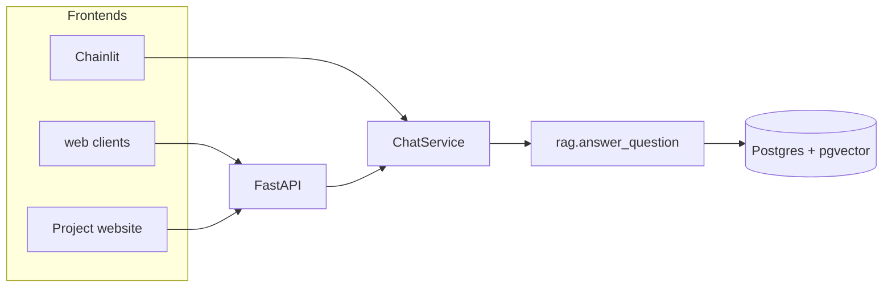

# SOILL Chatbot — Architectural approach

*Author:* Professor Stephen Hallett, 7 June 2026

This note assesses the chatbot architecture with FastAPI integration. This description excludes final hosting and embed decisions (see [deployment.md](deployment.md) for those options).

---

## Summary

For a domain-specific RAG chatbot of this scale, the current design offers a **sound, professional architecture**. It is genuinely **flexible**: multiple frontends can share one backend without duplicating RAG, citation, or logging logic. It is **architecturally robust** — clear layering, a shared service, and documented integration paths. It is **not yet fully hardened** for high-traffic or security-sensitive public use without further operational work (tests, rate limiting, monitoring). That follow-on work is normal; it does not undermine the design.

Chainlit was used to build and test early prototypes; the **production path** adopted here now is FastAPI plus embeddable web clients (see [deployment.md](deployment.md) and [`web/demos.html`](../web/demos.html)).

---

## Why this approach is seen to work well

### Clear separation of concerns

| Layer | Location | Role |
|-------|----------|------|
| UI | Chainlit, `web/`, future project site | Presentation only |
| Orchestration | `ChatService` in `packages/soill` | Query, citations, logging |
| RAG / data | `rag.py`, `store_pg.py`, embeddings | Retrieval and persistence |

UI is separate from orchestration and from RAG/data. New frontends call `ChatService` (directly or via FastAPI) without copying business logic.

### Sensible prototype → production path

- **Chainlit** — full-screen UI for development, internal trials, and Render-based testing.
- **FastAPI + embed options** — intended path for a public project website.
- **Structured API responses** — `answer`, `sources`, `session_id` suit widgets, dedicated pages, and future clients.
- **Session continuity** — `session_id` plus Postgres-backed history is appropriate for multi-turn public chat.

### Operational basics

- Shared monorepo (`soill` package)
- Environment-driven configuration
- Conversation logging to Postgres
- Admin CLIs for ingest and reporting
- Deployment guide and interactive demos

### Integration flexibility

| Pattern | Use case |
|---------|----------|
| Dedicated chat page | Prominent “Ask SOILL” area |
| Floating popup (iframe) | Site-wide access without a full page |
| Direct `POST /api/chat` | Custom JavaScript widget |

Iframe-first is a sensible MVP; a native widget calling the API is a natural upgrade without backend changes.

---

## Architecture (conceptual)

Chainlit and FastAPI are **sibling frontends** — both use the same `ChatService`.

---

## Where it is “good enough” vs “fully hardened”

The design supports production; the gaps below are typical next steps, not architectural flaws.

| Area | Current state | Typical next step |
|------|---------------|-------------------|
| Automated tests | Manual demos, Swagger, curl | Unit tests for `ChatService` and citations; API integration tests |
| API hardening | Minimal surface | Rate limiting, optional API keys, request size limits |
| Observability | DB conversation logging | Structured logs, metrics, error alerting |
| Resilience | Sync request/response | Timeouts, retries on Mistral, clear degradation messages |
| Security | Dev-oriented CORS | Production CORS lock-down, CSP for embeds, abuse protection |
| Scale | Single-process uvicorn | Horizontal scaling, connection pooling under load |

---

## Conclusion

Observations, this approach is:

**Flexible:** Yes — linked page, floating widget, or custom frontend without changing RAG logic.

**Robust (architecturally):** Yes — layering and shared service are maintainable and professional.

**Robust (production end-to-end):** Mostly — will still require adding tests, API protection, and monitoring before heavy public traffic.

This repo offers a credible foundation for the SOILL public assistant: not over-engineered, aligned with common RAG chatbot evolution from prototype (Chainlit) to production (API + embed).

---

## Related documents

- [approach.md](approach.md) — architectural rationale and assessment
- [deployment.md](deployment.md) — local testing, integration options, CORS, production deployment
- [README](../README.md) — development setup, Chainlit, admin commands
