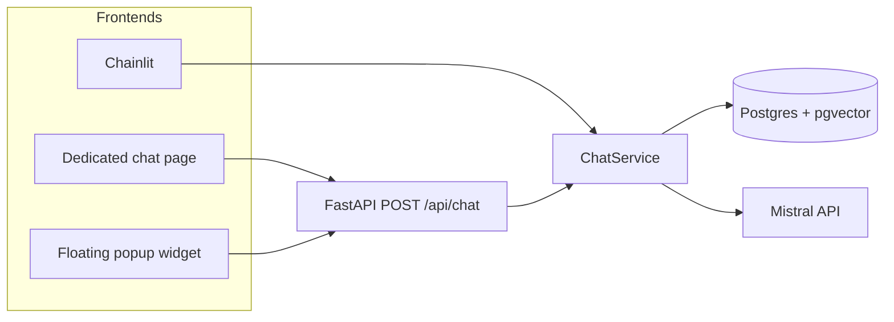

# SOILL Chatbot — Deployment and website integration

*Author:* Professor Stephen Hallett, 7 June 2026

This document describes how to deploy the SOILL chatbot for use on a **separate project website**. It covers local testing, production architecture, and the two main integration patterns.

**Chainlit** (`apps/chatbot/`) was used to build and test the RAG prototypes — a full-screen chat UI that runs locally or on Render and is ideal for development and internal trials. It is not, however, the intended way to embed the chatbot on a public project website. This document, together with the integration demos in [`web/demos.html`](../web/demos.html), describes the **production path**: the FastAPI API, test clients, and several alternative approaches for integrating the chatbot into your site (dedicated chat page, floating popup widget, iframe embed, and direct API calls).

For day-to-day development (Chainlit, ingest, admin commands), see the main [README](../README.md). For a rationale behind this architecture, see [approach.md](approach.md).

## Quick start — try it locally

1. Start the API:

   **uvicorn** is the web server that runs the FastAPI application. The command below is for local testing; `--reload` restarts the server when code changes (development only — not for production).

   ```bash
   uv run --directory apps/api uvicorn main:app --reload --port 8080
   ```

   In production you still use uvicorn, but without `--reload`, with `--host 0.0.0.0` and your host’s port (see [Production deployment](#production-deployment) below).

2. Open **[http://localhost:8080/web/demos.html](http://localhost:8080/web/demos.html)** and work through the steps in order — API docs, curl, then the HTML integration demos (full-page chat, dedicated page, floating popup).

The rest of this document explains the architecture, integration patterns, CORS, and production deployment in more detail.

---

## Architecture overview

The chatbot backend is shared across frontends:



| Component | Role | Typical deployment |
|-----------|------|-------------------|
| **Chainlit** (`apps/chatbot/`) | Full-screen chat UI for testing and internal use | Render (current default) |
| **FastAPI** (`apps/api/`) | HTTP API for external websites | Separate Render service or subdomain |
| **ChatService** (`packages/soill/`) | RAG, citations, logging | Bundled with each app |
| **Web clients** (`web/`) | Test pages and embeddable demos | Served by FastAPI at `/web/` |

Chainlit and the FastAPI API are **sibling frontends** — both call the same `ChatService`. The project website should use **FastAPI**, not Chainlit.

---

## Integration options

Two patterns are supported for a separate project website:

### Approach 1 — Floating popup (bottom-right widget)

A chat button fixed to the bottom-right of every page opens a panel (usually an iframe) containing the chat UI.

**Best for:** keeping the chat available site-wide without dedicating a full page.

**Local demo:** [http://localhost:8080/web/mock-site-popup.html](http://localhost:8080/web/mock-site-popup.html)

**Embed snippet (iframe widget):**

```html
<link rel="stylesheet" href="https://your-api-host/web/mock-site.css">
<script
  src="https://your-api-host/web/widget-iframe.js"
  data-chat-url="https://your-api-host/web/">
</script>
```

The widget script adds a toggle button and iframe panel. No CORS configuration is required for this pattern because the chat UI runs inside the iframe on the API host.

### Approach 2 — Dedicated chat page

A normal site page (e.g. `/ask-soill`) or a link in the navigation opens the full chat experience.

**Best for:** a prominent “Ask SOILL” area with more space for conversation and sources.

**Local demos:**

| Demo | URL |
|------|-----|
| Full chat page | [http://localhost:8080/web/](http://localhost:8080/web/) |
| Mock site with link + iframe embed | [http://localhost:8080/web/mock-site-page.html](http://localhost:8080/web/mock-site-page.html) |

**Option A — Link out:**

```html
<a href="https://your-api-host/web/">Ask SOILL</a>
```

**Option B — Embed in a page section:**

```html
<iframe
  src="https://your-api-host/web/"
  title="SOILL chatbot"
  style="width:100%;height:70vh;border:none;border-radius:12px;">
</iframe>
```

### Demo index

All local integration demos are listed at:

[http://localhost:8080/web/demos.html](http://localhost:8080/web/demos.html)

---

## Local testing

### 1. Start the API

**uvicorn** is the web server that runs the FastAPI application and listens for HTTP requests. The command below starts it on your machine for local testing; `--reload` automatically restarts the server when you change code (development only — do not use that flag in production).

In a production environment you would still use uvicorn (or a process manager in front of it), but without `--reload`, binding to all interfaces (`--host 0.0.0.0`) and the port provided by your host (e.g. Render’s `$PORT`). See [Deploy the FastAPI service](#deploy-the-fastapi-service) below for the production command.

```bash
uv sync --all-packages
uv run --directory apps/api uvicorn main:app --reload --port 8080
```

Stop with **Ctrl+C**.

### 2. Interactive API docs (Swagger)

**Swagger UI** is an interactive reference for the API, built automatically by FastAPI. Use it when you want to explore available endpoints, see request and response formats, and send test messages from your browser without writing code or using the terminal — handy for a quick sanity check that the API is working before trying the HTML demos.

With the server running, open:

- **Swagger UI:** [http://localhost:8080/docs](http://localhost:8080/docs) — try `POST /api/chat` from the browser
- **ReDoc:** [http://localhost:8080/redoc](http://localhost:8080/redoc)
- **Health check:** [http://localhost:8080/health](http://localhost:8080/health)

On the Swagger page, expand **POST /api/chat**, click **Try it out**, and send a body such as:

```json
{
  "message": "What is a living lab?"
}
```

Optional: pass `"session_id"` to continue a multi-turn conversation (history is loaded from the database when `CHAT_HISTORY_ENABLED=true`).

### 3. curl

**curl** sends an HTTP request from your terminal — useful when you want to test the API without a browser, script the same call in CI, or share an exact request with a colleague. Run the command below from any terminal (the API must already be running on port 8080). The response is printed as JSON in the terminal.

```bash
curl -X POST http://localhost:8080/api/chat \
  -H 'Content-Type: application/json' \
  -d '{"message": "What is soil health?"}'
```

### 4. HTML test client and integration demos

With the API running:

| URL | Description |
|-----|-------------|
| [http://localhost:8080/web/demos.html](http://localhost:8080/web/demos.html) | Index of integration options |
| [http://localhost:8080/web/](http://localhost:8080/web/) | Full-page chat client |
| [http://localhost:8080/web/mock-site-page.html](http://localhost:8080/web/mock-site-page.html) | Mock project site — dedicated chat page |
| [http://localhost:8080/web/mock-site-popup.html](http://localhost:8080/web/mock-site-popup.html) | Mock project site — floating popup widget |

Try the full-page chat client first, then the two mock project sites to see how the chatbot could appear on a separate website.

---

## CORS (cross-origin API calls)

CORS is only required when JavaScript on your **project website origin** calls `POST /api/chat` directly (a native widget without an iframe).

The iframe-based demos do **not** need CORS changes because the browser loads the chat page from the API host.

To allow a local project dev server (e.g. `http://localhost:5173`), add its origin to `allow_origins` in [`apps/api/main.py`](../apps/api/main.py). In production, allow only your project website domain(s), for example:

```python
allow_origins=[
    "https://www.soill-project.example",
    "https://soill-project.example",
]
```

Never use `allow_origins=["*"]` with credentials in production.

---

## Production deployment

### Recommended layout

| Service | Host example | Notes |
|---------|--------------|-------|
| Project website | `https://www.soill.eu` | Your existing CMS or static site |
| Chat API | `https://chat-api.soill.eu` | FastAPI on Render (Docker or native) |
| Chainlit (optional) | `https://chat-admin.soill.eu` | Internal/testing only; not required for public widget |

Both services share the same **Postgres** database (`DATABASE_URL`) and **Mistral** API key.

### Deploy the FastAPI service

1. Add a Render web service (or extend the blueprint) pointing at `apps/api/` with a start command such as:

   ```bash
   uv run --directory apps/api uvicorn main:app --host 0.0.0.0 --port $PORT
   ```

2. Set environment variables (same as Chainlit): `DATABASE_URL`, `MISTRAL_API_KEY`, `LOG_CONVERSATIONS`, etc.

3. Configure CORS with your production website origin.

4. Ensure the `web/` folder is included in the deployment context so `/web/` static files are served.

The current [`render.yaml`](../render.yaml) deploys **Chainlit only**. Adding the API is a separate service definition.

### Embed on the project website

After the API is deployed at `https://chat-api.example.org`:

**Floating popup:**

```html
<link rel="stylesheet" href="https://chat-api.example.org/web/mock-site.css">
<script
  src="https://chat-api.example.org/web/widget-iframe.js"
  data-chat-url="https://chat-api.example.org/web/">
</script>
```

**Dedicated page iframe:**

```html
<iframe
  src="https://chat-api.example.org/web/"
  title="SOILL chatbot"
  style="width:100%;min-height:600px;border:none;">
</iframe>
```

### Privacy and logging

Conversations from the API are logged to `soill_conversations` with `client_type="api"`. Ensure your project privacy notice covers stored questions, answers, and optional client metadata (`LOG_CLIENT_METADATA`).

---

## Choosing an approach

| Criterion | Floating popup | Dedicated page |
|-----------|----------------|----------------|
| Visibility | Always available | Requires navigation |
| Screen space | Compact panel | Full width/height |
| Implementation effort | Low (iframe widget) | Low (link or iframe) |
| Branding | Panel size limits styling | Easier to match site layout |
| Mobile | Panel may feel cramped | Full-page often better |

For an MVP, start with an **iframe** (either pattern). Move to a native JavaScript widget calling `/api/chat` later if you need tighter visual integration.

---

## Files reference

| Path | Purpose |
|------|---------|
| [`web/index.html`](../web/index.html) | Full-page chat UI |
| [`web/chat.js`](../web/chat.js) | Chat logic (`fetch` to `/api/chat`) |
| [`web/chat.css`](../web/chat.css) | Chat page styles |
| [`web/demos.html`](../web/demos.html) | Demo index |
| [`web/mock-site-page.html`](../web/mock-site-page.html) | Dedicated page demo |
| [`web/mock-site-popup.html`](../web/mock-site-popup.html) | Floating popup demo |
| [`web/widget-iframe.js`](../web/widget-iframe.js) | Embeddable popup widget |
| [`web/mock-site.css`](../web/mock-site.css) | Mock site and widget styles |
| [`apps/api/`](../apps/api/) | FastAPI application |

---

## Next steps

1. Try both demos locally (`mock-site-page.html` and `mock-site-popup.html`).
2. Decide popup vs dedicated page (or both).
3. Deploy FastAPI to a subdomain with production CORS.
4. Add the embed snippet to the project website.
5. Keep Chainlit for internal testing, or retire it from public use once the widget is live.
